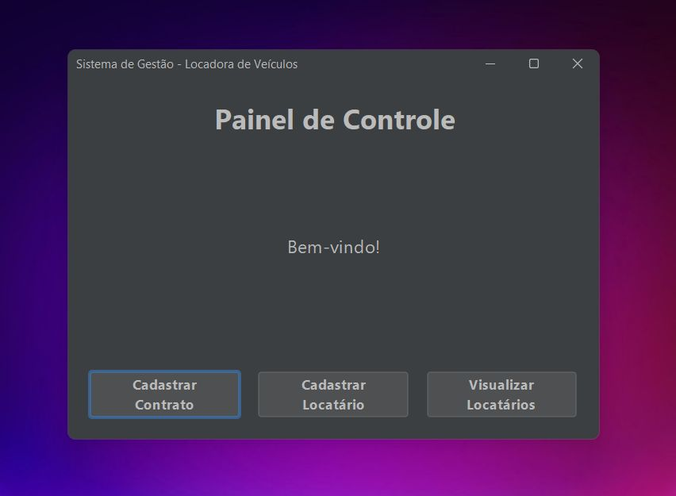

<!-- PORTFOLIO-FEATURED
title: Cadastro de Locatários e Contratos
description: Aplicação Java completa para cadastro de locatários e contratos, com interface gráfica, acesso a banco de dados MySQL e empacotamento via Maven. Projeto desktop independente com ícone personalizado.
technologies: Java, Swing/JavaFX, MySQL, Maven
demo: https://github.com/valentelucass/Locadora
highlight: true
image: locadora.jpg
-->
<p align="center">
  
</p>

## 🚀 Sistema de Cadastro de Locatários e Contratos

Este repositório contém um **projeto completo em Java**, desenvolvido como um grande desafio pessoal para integrar **Back-end, Front-end e banco de dados MySQL**, utilizando **Maven** e gerando uma aplicação independente com **atalho e ícone próprio**.

---

## 📌 Descrição do projeto

* **Back-end:**
  Classes Java para gerenciar **locatários** e **contratos**, implementando as camadas **DAO** para acesso ao banco de dados, seguindo boas práticas de conexão e manipulação de dados.

* **Front-end:**
  Telas gráficas criadas apenas com Java (Swing ou JavaFX, dependendo de como você fez), incluindo:

  * `TelaCadastroContrato`
  * `TelaCadastroLocatario`
  * `TelaListarLocatarios`
  * `PainelPrincipal`

* **Banco de Dados:**
  Estruturação completa no **MySQL**, desenvolvida manualmente, com tabelas para locatários, contratos e suas relações.

* **Execução independente:**
  Aplicação empacotada com **Maven**, gerando um `.jar` ou `.exe` com **ícone personalizado**, podendo ser executada direto do computador sem IDE.

---

## 🗂️ Principais arquivos

* `Main.java`: Classe principal que inicializa o programa.
* `DatabaseConnection.java`: Gerencia a conexão com o banco de dados MySQL.
* `Contrato.java` e `Locatario.java`: Classes de modelo.
* `ContratoDAO.java` e `LocatarioDAO.java`: Camada de acesso a dados.
* Telas de interface gráfica:

  * `PainelPrincipal.java`
  * `TelaCadastroContrato.java`
  * `TelaCadastroLocatario.java`
  * `TelaListarLocatarios.java`

---

## 🎯 Objetivo

* Consolidar conhecimentos de:

  * **Java orientado a objetos**
  * **Padrão DAO**
  * **Integração com MySQL**
  * **Desenvolvimento de interface gráfica**
  * **Empacotamento com Maven**
  * **Criação de aplicação independente para desktop**

---

## ⚙️ Tecnologias e Ferramentas

* **Java**
* **MySQL**
* **Maven**
* **IDE (IntelliJ)**
* **GEMINI (versão Pro) para auxiliar na escrita e revisão de código**

---

## 🚀 Como executar

1. **Clone o repositório**:

   ```bash
   git clone https://github.com/seuusuario/nomedorepositorio.git
   ```

2. **Configure o banco de dados MySQL** usando o script que você criou.

3. **Compile e rode o projeto** usando Maven:

   ```bash
   mvn clean install
   ```

4. **Execute o arquivo gerado** (JAR ou EXE) e use o programa diretamente no seu computador.

---

## 👨‍💻 Autor

Desenvolvido por **Lucas Andrade**, como parte de um desafio pessoal para aprender a **integrar Front-end, Back-end e Banco de Dados** de forma prática.
